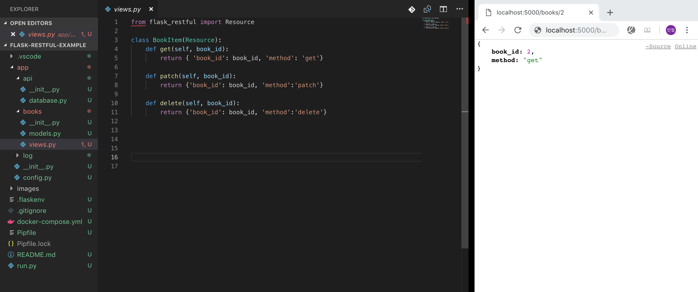

# Flask-Restplus-example 

flask-restplus = flask restful + swagger

## Dependency

1. pipenv

```
export PIPENV_VENV_IN_PROJECT=.
```

2. [direnv](https://github.com/direnv/direnv)

## Project Structure

I want to oriented clean architecture such as [go-clean-architecture](<https://github.com/bxcodec/go-clean-arch>)


```bash
Flask-RESTful-example
├── Pipfile
├── Pipfile.lock
├── README.md
├── app
│   ├── __init__.py
│   ├── api
│   │   ├── README.md
│   │   ├── __init__.py
│   │   ├── resources
│   │   │   ├── README.md
│   │   │   └── todo.py
│   │   └── rpc
│   │       ├── README.md
│   │       └── __init__.py
│   ├── config.py
│   ├── constants.py
│   ├── log
│   │   ├── README.md
│   │   └── app.log
│   ├── models
│   │   ├── README.md
│   │   ├── __init__.py
│   │   └── todo.py
│   ├── repository
│   │   ├── README.md
│   │   ├── __init__.py
│   │   └── database
│   │       ├── README.md
│   │       └── __init__.py
│   ├── services
│   │   ├── README.md
│   │   ├── __init__.py
│   │   └── todo_service.py
│   └── tests
│       ├── README.md
│       ├── __init__.py
│       ├── conftest.py
│       └── test_todo_service.py
├── confs
│   ├── README.md
│   ├── database
│   │   ├── README.md
│   │   └── mysql
│   └── manager
│       ├── README.md
│       └── systemd
├── docker-compose.yml
├── images
│   └── preview.png
├── manage.py
└── migrations
```

## How to run

```bash
docker-compose up -d
pip3 install pipenv
pipenv shell
pipenv run pip install pip==18.0
pipenv install
python manage.py run
```

## How to test

```
python manage.py test
```

## Preview



## Todo

- [ ] Unit Test
  - [ ] database mocking sqlalchemy-mock
- [ ] service layer refactoring
- [ ] api authorization
  - [ ] JWT
  - [ ] basic auth
- [ ] production configurations
  - [ ] Nginx
  - [ ] systemd
  - [ ] gunicorn
- [ ] add todo relationship(User, tag)